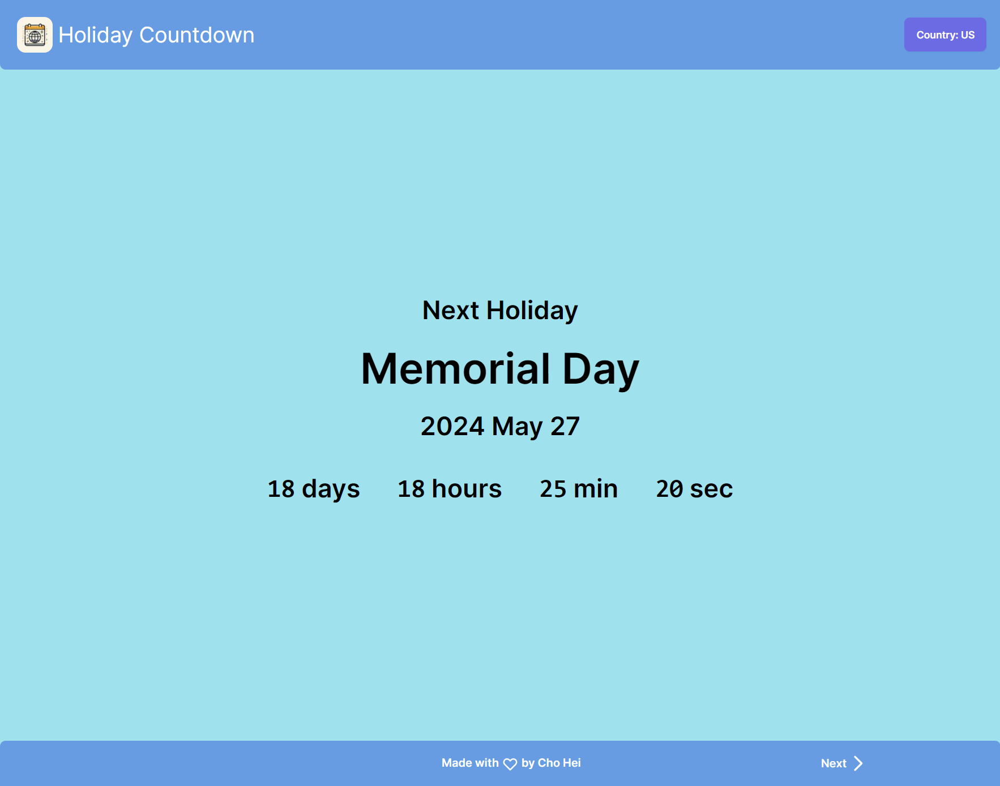

# Holiday Counter

A timer for the next national holiday in different countries. Built in NextJS using Javascript.

Deployed link: https://holidaycountdown.choheitoby.com/

## Features

- Automatically detect location using IP
- Various countries to choose
- Holiday data from external API

## Tech Stack

**Client:** NextJS, TailwindCSS, daisyUI

**API:** Calendarific API (Free version): https://calendarific.com/

**Testing:** Jest

### Preview:



## Installation:

```
git clone https://github.com/Cho-Hei/Holiday-Counter
cd Holiday-Counter
npm install
npm run build
npm run start

Add .env file with
HOLIDAY_KEY=[YOUR API KEY]
```
